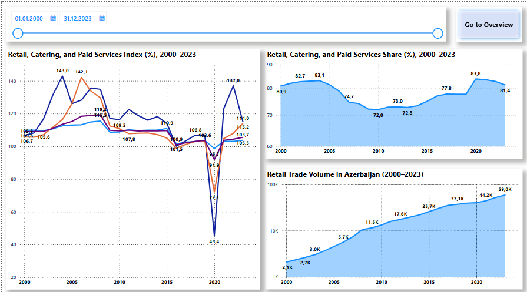
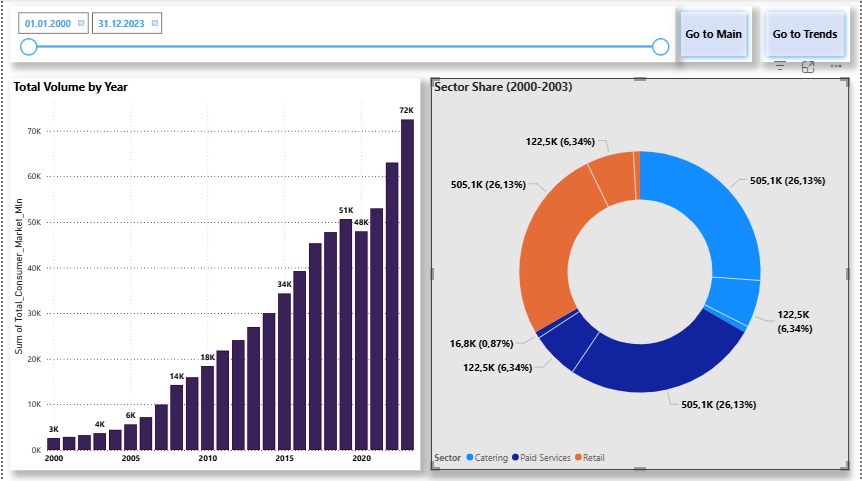
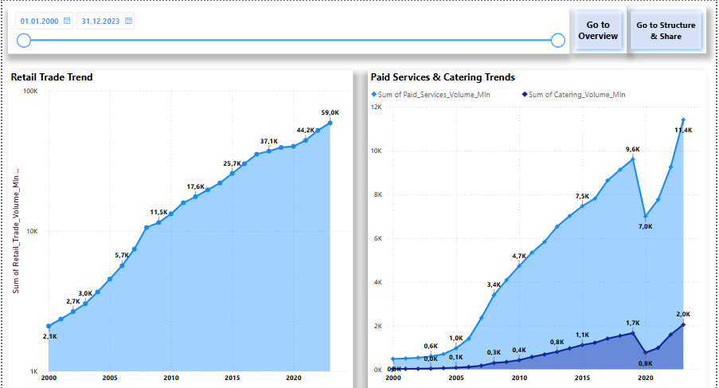
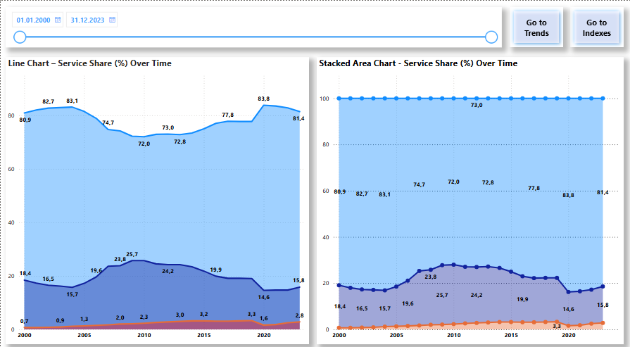
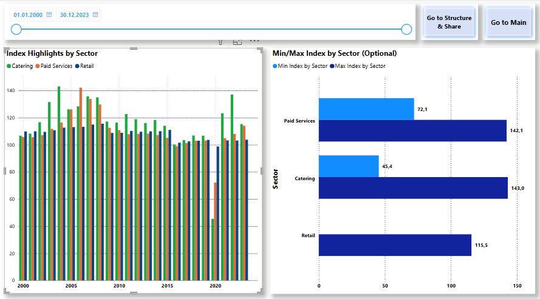

# Azerbaijan Retail Turnover Analysis

📊 **Power BI Project | National Retail & Services Sector Analysis (2000–2023)**  
🔗 Data Source: [stat.gov.az](https://www.stat.gov.az)

This project presents a detailed Power BI dashboard analyzing **retail trade**, **public catering**, and **paid services** turnover in Azerbaijan over more than two decades.

---

## 🎯 Project Objective

To visualize sectoral trends, structural market changes, and growth indexes in Azerbaijan's retail and services sector using official statistics. The project focuses on:

- Total sector volumes (in million AZN)
- Sector share in the total market (%)
- Annual growth indexes (%)
- Time series trends (2000–2023)

---

### 📁 Project Structure

```text
Azerbaijan-Retail-Turnover-Analysis/
│
├── Azerbaijan_Retail_Turnover_Analysis.pbix     # Power BI dashboard file
├── README.md                                    # Project documentation and structure
│
├── images/                                      # Dashboard screenshots & visuals
│   ├── Main.png
│   ├── Overview.png
│   ├── Trends.png
│   ├── Structure_Share.png
│   └── Indexes.png
│
├── Excel/                                       # Excel files used as data source
│   ├── Retail_Services_Volume.xlsx
│   ├── Retail_Services_Share.xlsx
│   └── Retail_Services_Indexes.xlsx
```

---

## 👨‍💻 Work Done

This project was fully designed and developed by **Amid Maharramov**, and includes:

### 📥 Data Collection & Preparation
- Extracted historical retail data manually from [stat.gov.az](https://www.stat.gov.az)
- Structured datasets in Excel:
  - Retail turnover (mln AZN)
  - Sector share of total (%)
  - Growth indexes (%)
- Created a custom Calendar table for time intelligence

### 🔧 Power BI Data Modeling
- Imported Excel files into Power BI
- Defined relationships across fact and dimension tables
- Applied proper formatting and metadata
- Built a clean and reusable semantic model

### 🧮 DAX Calculations
- Created custom measures for:
  - YoY growth, sector share, dynamic KPIs
- Used DAX for dynamic titles and conditional visibility

### 🎨 Report Design
- Designed **5-page interactive dashboard**:
  - Main | Overview | Trends | Structure & Share | Indexes
- Applied data visualization best practices:
  - Slicers, tooltips, consistent colors, clean layout

### 🌐 Localization
- Dashboard and documentation prepared in both **English** and **Azerbaijani**

---

## 📊 Report Pages Overview

### 1. 🟢 Main Dashboard
- High-level overview with KPIs for each sector
- Year filter with dynamic visuals
- Stacked bar for comparative sector volumes

### 2. 📋 Overview
- Year-by-year change in sector volumes
- Line and area charts to show cumulative patterns

### 3. 📈 Trends
- Sector-specific growth lines
- Consistent scale and dynamic tooltips for usability

### 4. 📊 Structure & Share
- Sector share (%) of total consumer market
- DAX-based percentage calculations
- Pie and bar charts with clear labeling

### 5. 📉 Indexes
- Annual growth indexes by sector
- Conditional coloring for up/down trends
- Mixed charts and tooltip explanations

---

## 🖼 Screenshots

| Page | Visual |
|------|--------|
| Main |  |
| Overview |  |
| Trends |  |
| Structure_Share |  |
| Indexes |  |

---

## 🇦🇿 Layihə Haqqında (Azərbaycan dilində)

### 🔍 Layihənin Məqsədi

Azərbaycan üzrə **pərakəndə satış**, **iaşə** və **ödənişli xidmətlər** sektorlarının **2000–2023-cü illər** üzrə statistik təhlilinin Power BI vasitəsilə vizuallaşdırılması.

### 📦 Fayl Quruluşu

- Power BI dashboard (.pbix)
- 3 əsas Excel faylı: dövriyyə, pay və indekslər
- 5 vizual səhifənin şəkilləri ("images" qovluğunda)

### 👨‍💻 Görülən İşlər

- Məlumatların toplanması və Excel fayllarının strukturlaşdırılması
- Power BI modelinin qurulması və əlaqələrin yaradılması
- DAX ilə ölçülərin hesablanması (məsələn, illik artım, sektor payı)
- 5 səhifəlik interaktiv hesabatın hazırlanması
- Vizual dizayn və rəng bölgüsü ilə oxunaqlılığın təmin edilməsi
- Sənədlərin və vizualların iki dildə təqdim edilməsi

---

## 📩 Contact

For more information or collaboration:  
📧 **amid.meherremov@gmail.com**  
🌐 **GitHub:** [github.com/AmidTahmasib](https://github.com/AmidTahmasib)
