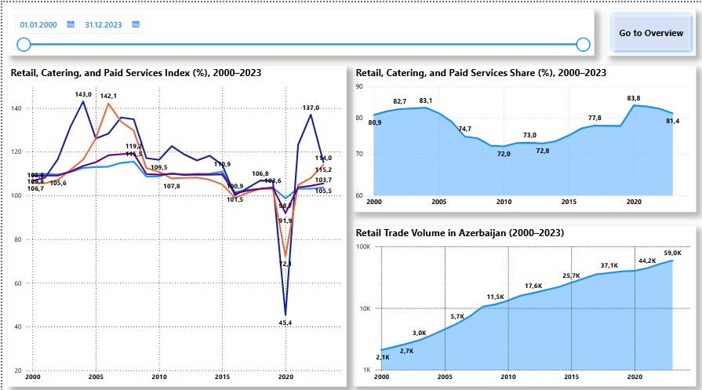
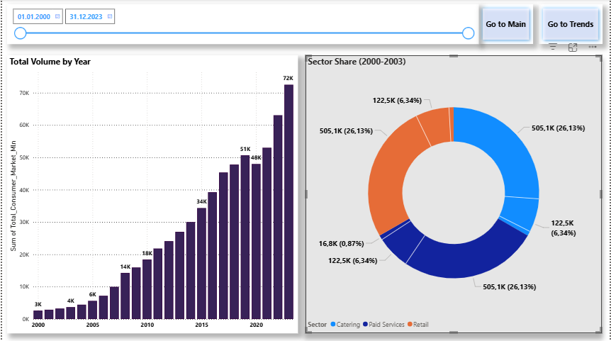
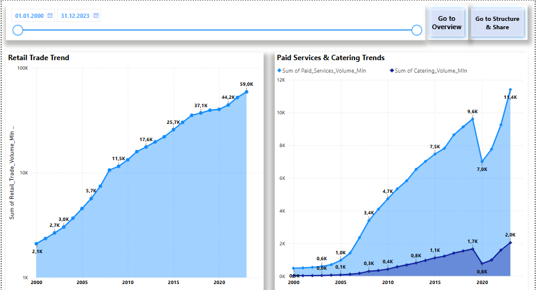
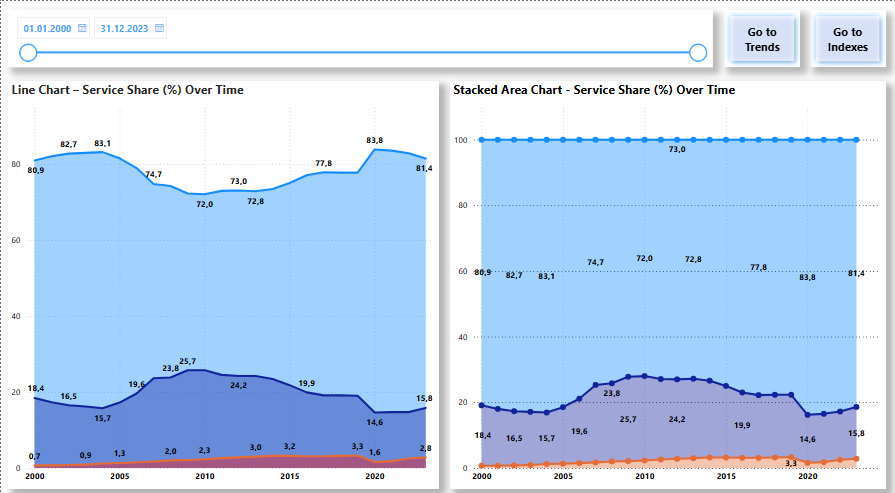
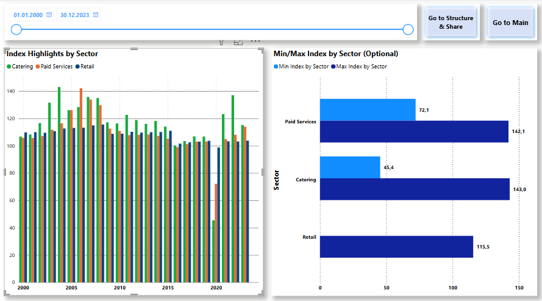

# Azerbaijan Retail Turnover Analysis

📊 **Power BI Project | National Retail & Services Sector Analysis (2000–2023)**  
🔗 Data Source: [stat.gov.az](https://www.stat.gov.az)

This project presents a detailed Power BI dashboard analyzing **retail trade**, **public catering**, and **paid services** turnover in Azerbaijan over more than two decades.

---

## 🎯 Project Objective

To visualize sectoral trends, structural market changes, and growth indexes in Azerbaijan's retail and services sector using official statistics. The project focuses on:

- Total sector volumes (in million AZN)
- Sector share in the total market (%)
- Annual growth indexes (%)
- Time series trends (2000–2023)

---

### 📁 Project Structure

```text
Azerbaijan-Retail-Turnover-Analysis/
│
├── Azerbaijan_Retail_Turnover_Analysis.pbix     # Power BI dashboard file
│
├── README.md                                    # Project documentation and structure
│
├── License.txt                                  # MIT License
│
├── images/                                      # Dashboard screenshots & visuals
│   ├── Main.png
│   ├── Overview.png
│   ├── Trends.png
│   ├── Structure_Share.png
│   └── Indexes.png
│
├── Excel/                                       # Excel files used as data source
│   ├── Retail_Services_Volume.xlsx
│   ├── Retail_Services_Share.xlsx
│   └── Retail_Services_Indexes.xlsx
```

---

## 👨‍💻 Work Done

This project was fully designed and developed by **Amid Tahmasib**, and includes:

### 📥 Data Collection & Preparation
- Extracted historical retail data manually from [stat.gov.az](https://www.stat.gov.az)
- Structured datasets in Excel:
  - Retail turnover (mln AZN)
  - Sector share of total (%)
  - Growth indexes (%)
- Created a custom Calendar table for time intelligence

### 🔧 Power BI Data Modeling
- Imported Excel files into Power BI
- Defined relationships across fact and dimension tables
- Applied proper formatting and metadata
- Built a clean and reusable semantic model

### 🧮 DAX Calculations
- Created custom measures for:
  - YoY growth, sector share, dynamic KPIs
- Used DAX for dynamic titles and conditional visibility

### 🎨 Report Design
- Designed **5-page interactive dashboard**:
  - Main | Overview | Trends | Structure & Share | Indexes
- Applied data visualization best practices:
  - Slicers, tooltips, consistent colors, clean layout

### 🌐 Localization
- Dashboard and documentation prepared in both **English** and **Azerbaijani**

---

## 📊 Report Pages & Visuals

This section provides a detailed breakdown of each page in the report, its analytical purpose, and the technical configuration of the visuals used.

> **Common Elements:**  
> Each page includes:
> - 🎚️ A **Slicer** to filter by year  
> - 🔘 **Navigation Buttons** to move between report pages  

---


### 1. ⚪ Main (Key Indicators)

**📌 Page Purpose:**  
Provides a high-level summary, consolidating the market share and volume of the retail sector, along with index changes for all sectors.

#### 📈 Visual 1: Line Chart

**Purpose:**  
Compare annual growth/decline indexes of all sectors and the total market on a single chart, showing how each sector reacts to economic cycles.

**Configuration:**
- X-axis: `Year`
- Y-axis:
  - `Sum of Retail_İndex_Percent`
  - `Sum of Catering_İndex_Percent`
  - `Sum of Paid_Services_İndex_Percent`
  - `Sum of Total_Market_İndex_Percent`

#### 📉 Visual 2: Area Chart

**Purpose:**  
Track the evolution of the retail trade sector's market share (as a percentage).

**Configuration:**
- X-axis: `Year`
- Y-axis: `Sum of Retail_Share_Percent`

#### 📊 Visual 3: Area Chart

**Purpose:**  
Visualize the absolute growth in retail turnover volume (in Million AZN).

**Configuration:**
- X-axis: `Year`
- Y-axis: `Sum of Retail_Trade_Volume_Mln`

| Main |  |

---


### 2. ⚪ Overview

**📌 Page Purpose:**  
Displays total consumer market volume and its proportional breakdown by sector.

#### 📊 Visual 1: Stacked Column Chart

**Purpose:**  
Show overall market growth, with tooltips breaking down sector contributions per year.

**Configuration:**
- X-axis: `Date`
- Y-axis: `Sum of Total_Consumers_Market_Mln`
- Tooltips:
  - `Sum of Retail_Trade_Volume_Mln`
  - `Sum of Paid_Services_Volume_Mln`
  - `Sum of Catering_Volume_Mln`

#### 🍩 Visual 2: Donut Chart

**Purpose:**  
To display each sector's contribution to the total turnover across the entire 2000–2023 period. This visual helps in understanding the long-term market structure and sector dominance.

**Configuration:**
- Legend: `Sector`
- Values:
  - `Sum of Retail_Trade_Volume_Mln`
  - `Sum of Paid_Services_Volume_Mln`
  - `Sum of Catering_Volume_Mln`

| Overview |  |

---


### 3. ⚪ Trends

**📌 Page Purpose:**  
Track the turnover volume trends of each sector separately due to differing scales.

#### 📈 Visual 1: Line Chart

**Purpose:**  
Display the growth trend of the **retail trade sector** in isolation.

**Configuration:**
- X-axis: `Year`
- Y-axis: `Sum of Retail_Trade_Volume_Mln`

#### 📉 Visual 2: Line Chart

**Purpose:**  
Compare **paid services** and **catering** sector trends on the same scale.

**Configuration:**
- X-axis: `Year`
- Y-axis:
  - `Sum of Paid_Services_Volume_Mln`
  - `Sum of Catering_Volume_Mln`

| Trends |  |

---


### 4. ⚪ Structure & Share

**📌 Page Purpose:**  
Analyze how the **market structure** evolved — i.e., sector shares over time.

#### 📈 Visual 1: Line Chart

**Purpose:**  
Track the market share trends of all sectors, showing shifts and intersections.

**Configuration:**
- X-axis: `Year`
- Y-axis:
  - `Sum of Retail_Share_Percent`
  - `Sum of Paid_Services_Share_Percent`
  - `Sum of Catering_Share_Percent`

#### 🧩 Visual 2: Stacked Area Chart

**Purpose:**  
Visualize how the total market (100%) was split among sectors yearly.

**Configuration:**
- X-axis: `Year`
- Y-axis:
  - `Sum of Retail_Share_Percent`
  - `Sum of Paid_Services_Share_Percent`
  - `Sum of Catering_Share_Percent`

| Structure_Share |  |

---


### 5. ⚪ Indexes

**📌 Page Purpose:**  
Analyze **real physical growth**, adjusted for inflation, to find sectoral peaks and lows.

#### 📊 Visual 1: Clustered Column Chart

**Purpose:**  
Compare real growth indexes of sectors year-by-year.

**Configuration:**
- X-axis: `Year`
- Y-axis: `Sum of İndex_Percent`
- Legend: `Sector`
- Tooltip: `First İndex_Flag`

#### 📊 Visual 2: Clustered Bar Chart

**Purpose:**  
Display **min/max index values** per sector for the full period (2000–2023), showing performance extremes.

**Configuration:**
- Y-axis: `Sector`
- X-axis:
  - `Min İndex by Sector`
  - `Max İndex by Sector`

| Indexes |  |

---


# Azərbaycanda Pərakəndə Ticarət Dövriyyəsi Analizi (Azərbaycan dilində)

### 🔍 Layihənin Məqsədi

Azərbaycan üzrə **pərakəndə satış**, **iaşə** və **ödənişli xidmətlər** sektorlarının **2000–2023-cü illər** üzrə statistik təhlilinin Power BI vasitəsilə vizuallaşdırılması.

### 📦 Fayl Quruluşu

- Power BI dashboard (.pbix)
- 3 əsas Excel faylı: dövriyyə, pay və indekslər
- 5 vizual səhifənin şəkilləri ("images" qovluğunda)

### 👨‍💻 Görülən İşlər

- Məlumatların toplanması və Excel fayllarının strukturlaşdırılması
- Power BI modelinin qurulması və əlaqələrin yaradılması
- DAX ilə ölçülərin hesablanması (məsələn, illik artım, sektor payı)
- 5 səhifəlik interaktiv hesabatın hazırlanması
- Vizual dizayn və rəng bölgüsü ilə oxunaqlılığın təmin edilməsi
- Sənədlərin və vizualların iki dildə təqdim edilməsi

---

## 📊 Hesabat Səhifələri və Vizuallar

Bu bölmədə hesabatdakı hər bir səhifə, onun analitik məqsədi və istifadə olunan vizualların texniki konfiqurasiyası haqqında ətraflı məlumat verilir.

> **Ümumi Elementlər:**  
> Hər səhifədə:
> - 🎚️ İllərə görə **Slicer**  
> - 🔘 Səhifələr arasında rahat keçid üçün **Naviqasiya Düymələri (Navigation Buttons)** mövcuddur.

---

### 1. ⚪ Main (Əsas Göstəricilər)

**📌 Səhifənin Məqsədi:**  
Pərakəndə ticarət sektorunun bazar payı, həcmi və bütün sektorların indeks dəyişimlərini ümumi mənzərə ilə təqdim edir.

#### 📈 Vizual 1: Line Chart

**Məqsəd:**  
Bütün sektorların və ümumi bazarın illik artım/azalma indekslərini müqayisə edərək iqtisadi tsikllərə reaksiyanı anlamaq.

**Konfiqurasiya:**
- X-oxu: `Year`
- Y-oxu:
  - `Retail_İndex_Percent`
  - `Catering_İndex_Percent`
  - `Paid_Services_İndex_Percent`
  - `Total_Market_İndex_Percent`

#### 📉 Vizual 2: Area Chart

**Məqsəd:**  
Pərakəndə ticarət sektorunun ümumi bazardakı payının zamanla necə dəyişdiyini izləmək.

**Konfiqurasiya:**
- X-oxu: `Year`
- Y-oxu: `Retail_Share_Percent`

#### 📊 Vizual 3: Area Chart

**Məqsəd:**  
Pərakəndə ticarət sektorunun dövriyyə həcminin (mln AZN) illər üzrə artımını göstərmək.

**Konfiqurasiya:**
- X-oxu: `Year`
- Y-oxu: `Retail_Trade_Volume_Mln`

---

### 2. ⚪ Overview (İcmal)

**📌 Səhifənin Məqsədi:**  
Ümumi istehlak bazarının həcmini və sektorlar üzrə pay bölgüsünü göstərmək.

#### 📊 Vizual 1: Stacked Column Chart

**Məqsəd:**  
Ümumi bazar həcminin illər üzrə artımını göstərmək və hər il sektorların nə qədər töhfə verdiyini tooltip-lərlə göstərmək.

**Konfiqurasiya:**
- X-oxu: `Date`
- Y-oxu: `Total_Consumers_Market_Mln`
- Tooltip-lər:
  - `Retail_Trade_Volume_Mln`
  - `Paid_Services_Volume_Mln`
  - `Catering_Volume_Mln`

#### 🍩 Vizual 2: Donut Chart

**Məqsəd:**  
2000–2023-cü illər ərzində hər bir sektorun ümumi dövriyyəyə verdiyi ümumi töhfəni faizlə göstərmək. Bu, sektorların uzunmüddətli bazar payını müqayisə etmək üçün istifadə olunur.

**Konfiqurasiya:**
- Legend: `Sector`
- Dəyərlər:
  - `Retail_Trade_Volume_Mln`
  - `Paid_Services_Volume_Mln`
  - `Catering_Volume_Mln`

---

### 3. ⚪ Trends (Trendlər)

**📌 Səhifənin Məqsədi:**  
Hər sektorun dövriyyə trendini aydın və ayrıca analiz etmək.

#### 📈 Vizual 1: Line Chart

**Məqsəd:**  
Pərakəndə sektorunun (ən böyük həcmli) artım trendini təkbaşına göstərmək.

**Konfiqurasiya:**
- X-oxu: `Year`
- Y-oxu: `Retail_Trade_Volume_Mln`

#### 📉 Vizual 2: Line Chart

**Məqsəd:**  
Həcm baxımından yaxın olan ödənişli xidmətlər və iaşə sektorlarını eyni qrafikdə müqayisə etmək.

**Konfiqurasiya:**
- X-oxu: `Year`
- Y-oxu:
  - `Paid_Services_Volume_Mln`
  - `Catering_Volume_Mln`

---

### 4. ⚪ Structure & Share (Struktur və Pay)

**📌 Səhifənin Məqsədi:**  
Sektorların bazar strukturundakı dəyişikliklərini təhlil etmək.

#### 📈 Vizual 1: Line Chart

**Məqsəd:**  
Sektorların bazar payı trendlərini eyni vizualda göstərmək və dəyişiklikləri izləmək.

**Konfiqurasiya:**
- X-oxu: `Year`
- Y-oxu:
  - `Retail_Share_Percent`
  - `Paid_Services_Share_Percent`
  - `Catering_Share_Percent`

#### 🧩 Vizual 2: Stacked Area Chart

**Məqsəd:**  
Ümumi bazarın (100 %) illər üzrə sektorlar arasında necə paylandığını göstərmək.

**Konfiqurasiya:**
- X-oxu: `Year`
- Y-oxu:
  - `Retail_Share_Percent`
  - `Paid_Services_Share_Percent`
  - `Catering_Share_Percent`

---

### 5. ⚪ Indexes (İndekslər)

**📌 Səhifənin Məqsədi:**  
Real fiziki həcm artımını (inflyasiyadan təmizlənmiş) təhlil etmək və sektorların zirvə göstəricilərini müəyyənləşdirmək.

#### 📊 Vizual 1: Clustered Column Chart

**Məqsəd:**  
Sektorların illik indekslərini müqayisə etmək.

**Konfiqurasiya:**
- X-oxu: `Year`
- Y-oxu: `İndex_Percent`
- Əfsanə: `Sector`
- Tooltip: `First_İndex_Flag`

#### 📊 Vizual 2: Clustered Bar Chart

**Məqsəd:**  
2000–2023 dövründə hər sektorun ən yüksək və ən aşağı indekslərini göstərmək.

**Konfiqurasiya:**
- Y-oxu: `Sector`
- X-oxu:
  - `Min İndex by Sector`
  - `Max İndex by Sector`

---

## 📄 License

This project is licensed under the MIT License — use, modify, and distribute freely.

---

## 📩 Contact

For more information or collaboration:  
📧 **amid.meherremov@gmail.com**  
🌐 **LinkedIn:** [[LinkedIn.com/AmidTahmasib](https://www.linkedin.com/in/amidtahmasib/)]
